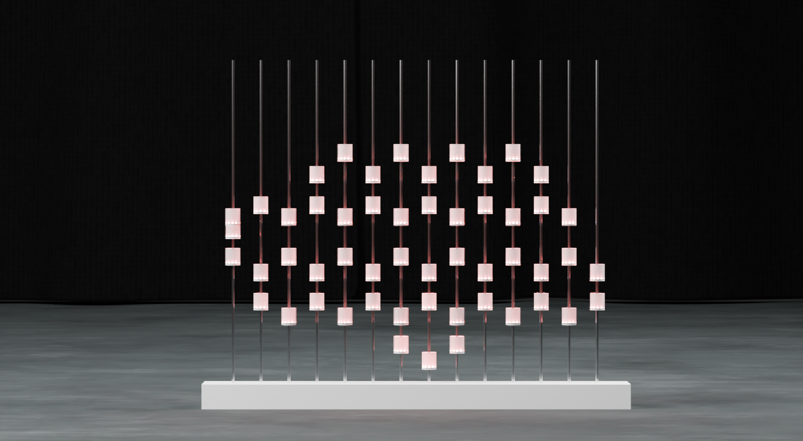
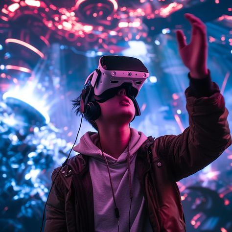
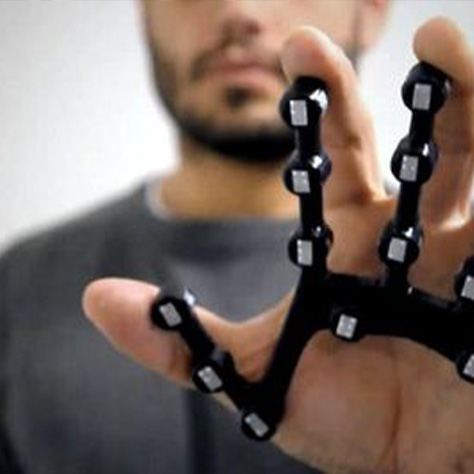
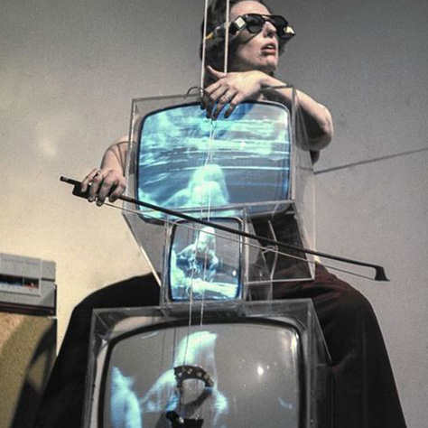
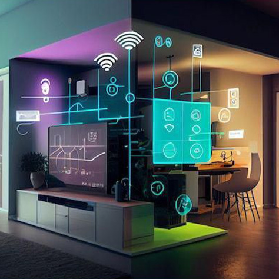
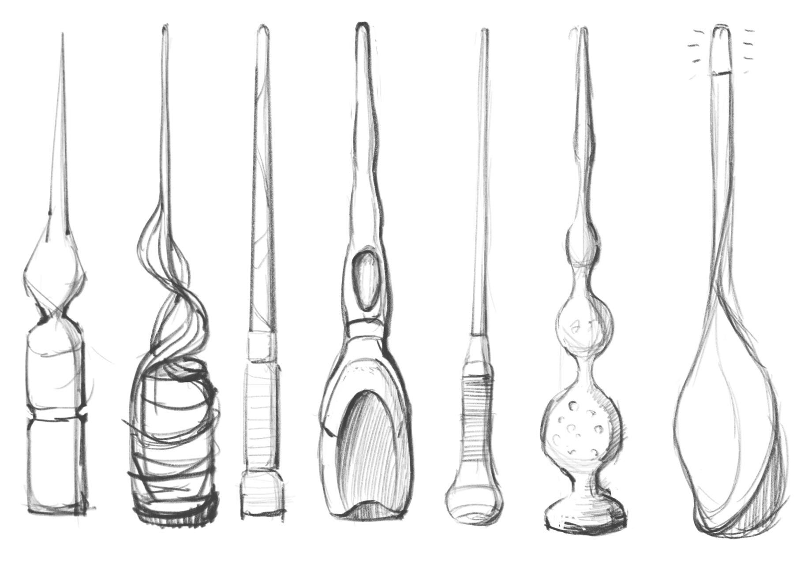
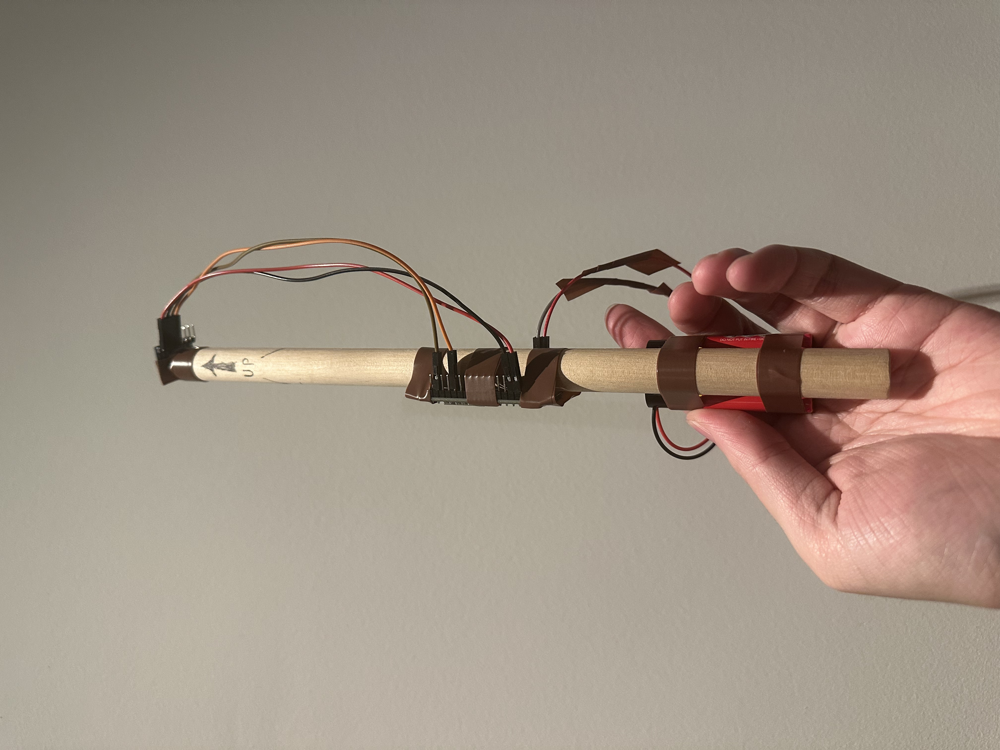
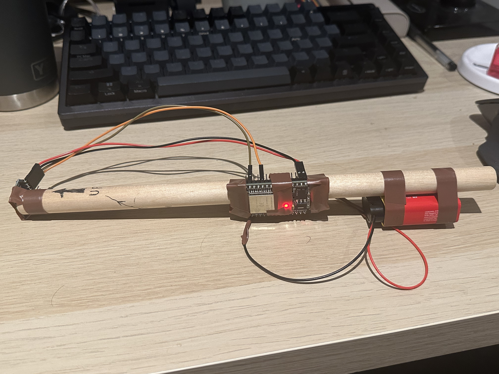
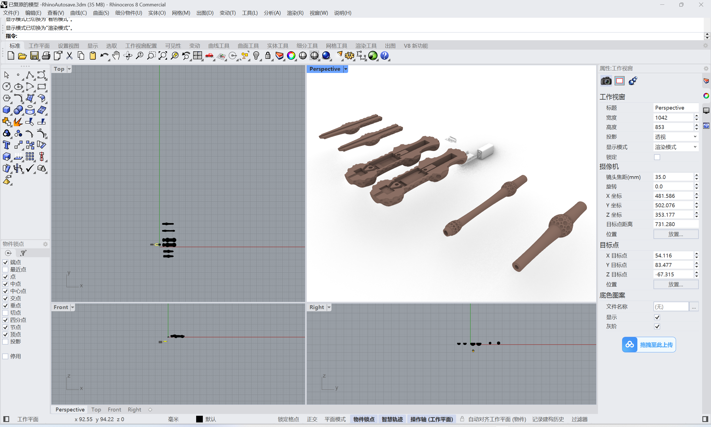
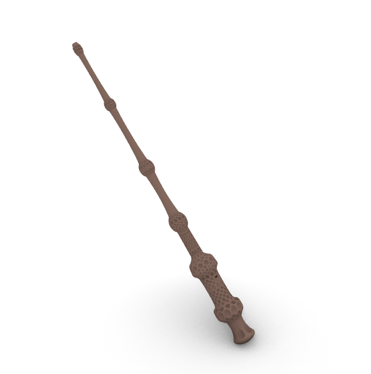

# CASA0014: Connected Environments 24/25_LumoStick


<!--<div style="position: relative; padding-bottom: 56.25%; height: 0; overflow: hidden;">
  <iframe 
    src="https://www.youtube.com/embed/dQw4w9WgXcQ" 
    style="position: absolute; top: 0; left: 0; width: 100%; height: 100%;" 
    frameborder="0" 
    allow="accelerometer; autoplay; clipboard-write; encrypted-media; gyroscope; picture-in-picture" 
    allowfullscreen>
  </iframe>
</div>
-->


## 🌟 Project Overview
<!-- Lumostick是一款由 ESP32 和 MPU6050 驱动的手势控制棒，能够触发 Neopixel 环形矩阵 Chrono Lumina 上的效果。除了操控LED灯本身之外，Lumostick的项目还帮助我开始学习使用机器学习来处理数据以及进一步探索人和IoT系统的交互关系-->


**Lumostick** is a gesture-controlled wand powered by ESP32 and MPU6050, capable of triggering effects on Chrono Lumina (https://github.com/ucl-casa-ce/casa0014/tree/271e6a09e3415dd92d1bf312cf6354610c04c1a2/chronoLumina), a matrix of 53 Neopixel rings. Beyond  manipulating the LED itself, this project helped me start learning to use machine learning to process data and further explore the interaction between people and IoT systems.

---
<!-- 🎯 灵感与愿景
重新思考交互模式
传统界面：手机、键盘和触摸屏主导着物联网交互，但在直观、沉浸式和免提应用方面存在局限性。
手势控制：利用自然的人体动作与技术互动可以创造更直观、更易获得的体验。
未来的应用
虚拟现实 (VR)：基于手势的控制增强了沉浸感和交互性，从而无需在 VR/AR 环境中使用物理控制器。
辅助技术：手势识别可以为残障人士提供便捷的方式来控制设备，从智能家居系统到移动辅助设备。
互动艺术与表演：艺术家和表演者可以使用基于手势的工具来创建动态和响应的环境。
日常物联网设备：从照明到智能家电，手势控制提供了一种与连接设备交互的无缝且引人入胜的方式。
更广泛的影响
Lumostick 的方法展示了物联网和人工智能在重新定义人类与技术互动方式方面的潜力。通过探索替代界面，它为各个领域的包容性和沉浸式创新开辟了可能性。
-->

## 🎯 Inspiration and Vision
<!--当我面对Chrono Lumina并思考应该如何控制它的时候，我本能地伸出双手在空中比划，像是想要指挥这个光的“交响乐团”演奏。我进一步联想到系列电影‘哈利波特’中巫师们用魔杖操控物体的场景，联网设备之间的关系不正像这种无形的魔力连接吗？而人类作为IoT系统的一环，能不能掌握巫师那般的操控力呢？-->
**Origin** When I faced the Chrono Lumina and thought about how I should control it, I instinctively stretched out my hands in the air, as if I wanted to conduct the symphony orchestra of light. I further think of the scenes in the movie series 'Harry Potter' where wizards manipulate objects with wands. Isn't the relationship between connected devices just like this invisible magical connection? And as a part of the IoT system, can humans master the control power of wizards?

### Rethinking Interaction Modes
1. **Traditional Interfaces**: Phones, keyboards, and touchscreens dominate IoT interactions but have limitations in intuitive, immersive, and hands-free applications.
2. **Gesture Control**: Harnessing natural human motions to interact with technology can create more intuitive and accessible experiences.


<table style="width: 100%; text-align: center; border-spacing: 20px;">
  <tr>
    <td>
      
      <p>Virtual Reality</p>
    </td>
    <td>
      
      <p>Assistive Technology</p>
    </td>
  </tr>
  <tr>
    <td>
      
      <p>Interactive Art and Performance</p>
    </td>
    <td>
      
      <p>Smart Home Devices</p>
    </td>
  </tr>
</table>


### Broader Impact
Lumostick's approach showcases the potential of IoT and AI in redefining how humans interact with technology. By exploring alternative interfaces, it opens up possibilities for inclusive and immersive innovations in various fields.

---

## 🚀 Features of Lumostick
- **Motion Recognition**: Employs TensorFlow Lite for precise pattern recognition.
- **Dynamic Visual Feedback**: Displays unique lighting effects on Chrono Lumina.
- **Wireless Control**: Operates through ESP32 for seamless and untethered usage.
- **Customizable Framework**: Easily expandable to recognize additional gestures and control other devices.


---

## 🚀 Design






  
---

## 🛠️ Technical Overview

### System Workflow
```plaintext
[Gesture Input] -> [MPU6050 Sensor] -> [ESP32 Processing via TensorFlow Lite] -> [Neopixel Control] -> [Visual Output on Chrono Lumina]
```

### Key Technologies
- **Chrono Lumina**: Neopixel ring matrix for dynamic light displays.
- **ESP32**: The central processing unit, handling gesture recognition and device control.
- **MPU6050**: A six-axis motion sensor capturing real-time gestures.
```cpp
// Fast motion detection
if (absX > absY && absX > absZ && absX > fastMotionThreshold) {
    primaryDirection = accXg > 0 ? "X" : "-X";
    currentMagnitude = absX;
} else if (absY > absX && absY > absZ && absY > fastMotionThreshold) {
    primaryDirection = accYg > 0 ? "Y" : "-Y";
    currentMagnitude = absY;
} else if (absZ > absX && absZ > absY && absZ > fastMotionThreshold) {
    primaryDirection = accZg > 0 ? "Z" : "-Z";
    currentMagnitude = absZ;
}

// Detect return-to-origin motion
if (!primaryDirection.isEmpty() && !lastDirection.isEmpty() && 
    primaryDirection == inverseDirection(lastDirection) &&
    fabs(currentMagnitude - lastMagnitude) < returnTolerance) {
    Serial.println("Return-to-origin motion detected, recalibrating offsets");
    calibrateOffsetsFast();
    lastDirection = ""; // Clear last motion
    lastMagnitude = 0;
    lastNoMovementTime = currentTime; // Reset no-motion timer
}
// Output fast motion result
else if (!primaryDirection.isEmpty() && (currentTime - lastMovementTime > movementCooldown)) {
    Serial.println(primaryDirection + " direction fast motion detected");
    lastDirection = primaryDirection; // Save current motion direction
    lastMagnitude = currentMagnitude; // Save current motion magnitude
    calibrateOffsetsFast(); // Recalibrate offsets after fast motion
    lastMovementTime = currentTime; // Update last motion time
    lastNoMovementTime = currentTime; // Reset no-motion timer
}
// Detect slow motion and recalibrate offsets
else if (primaryDirection.isEmpty() && 
         (absX > slowMotionThreshold || absY > slowMotionThreshold || absZ > slowMotionThreshold)) {
    calibrateOffsetsFast(); // Recalibrate offsets during slow motion
    lastNoMovementTime = currentTime; // Reset no-motion timer
}
// No motion detected
else if (primaryDirection.isEmpty() && (currentTime - lastNoMovementTime > noMovementInterval)) {
    Serial.println("No motion detected");
    lastNoMovementTime = currentTime;
}

delay(200); // Delay for better observation of data
```

The most difficult part of using the MPU6050 is to identify the threshold and excessive hand movements, such as when I wave the wand, I will habitually withdraw it, which will be detected by the sensor as two movements, so I introduced a homing mechanism.

- **TensorFlow Lite**: Machine learning library for on-device gesture pattern recognition.


<table>
  <tr>
    <td></td>
    <td></td>
    <td></td>
  </tr>
</table>


### Open-Source Ecosystem
I got the three models they trained from tensorflowlite, after all the initial test identification, the next step is to implement them on Chrono Lumina.

Thanks for the open source model provided by the Tensorflow team. In the next step, I will follow the tutorials provided by Tensorflow to train my own model, which may be a love, and move towards the further goal!

---

## 🔮 Exploring Gesture-Based IoT Interaction

### Why Gesture Control?
1. **Natural and Intuitive**: Gestures align closely with human behavior, enabling users to interact with technology effortlessly.
2. **Hands-Free Operation**: Ideal for scenarios where touch-based interfaces are impractical.
3. **Enhanced Immersion**: Particularly valuable in VR/AR applications, where physical controllers may disrupt the user experience.

### Challenges and Opportunities
1. **Challenges**:
   - Ensuring accuracy and reliability in gesture recognition.
   - Developing adaptable systems for diverse user needs.
2. **Opportunities**:
   - Bridging the gap between humans and technology for inclusivity and accessibility.
   - Creating new interaction paradigms for future IoT and VR devices.

---
## 📚 References

- TensorFlow Lite: [https://www.tensorflow.org/lite](https://www.tensorflow.org/lite)
- TensorFlow (ESP32 Version):[https://github.com/petewarden/magic_wand]
- ESP32 Documentation: [https://espressif.com/](https://espressif.com/)
- Chrono Lumina (Neopixel Matrix): [https://github.com/ucl-casa-ce/casa0014/tree/271e6a09e3415dd92d1bf312cf6354610c04c1a2/chronoLumina]

---

## 🙌 Digital Twin Project
<!-- Lumostick是一款由 ESP32 和 MPU6050 驱动的手势控制棒，能够触发 Neopixel 环形矩阵 Chrono Lumina 上的效果。除了操控LED灯本身之外，Lumostick的项目还帮助我开始学习使用机器学习来处理数据以及进一步探索人和IoT系统的交互关系-->

If time permits, I am planning to build a digital twin for Chrono Lumina, which will be beneficial for the testing of lighting effects and sustainable use in the future. Welcome to join, you can see my model building and lighting grouping for Chrono Lumina in my library.

---

## 📚 Reflection

- The recognition accuracy of the MPU6050 is not high and requires more training.
- If I want to approach intelligent control, you need to reduce the size of the hardware and increase the multi-dimensional control, such as sound.

